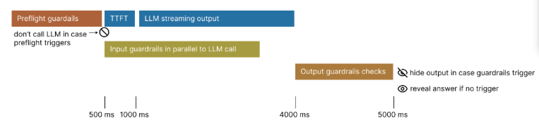
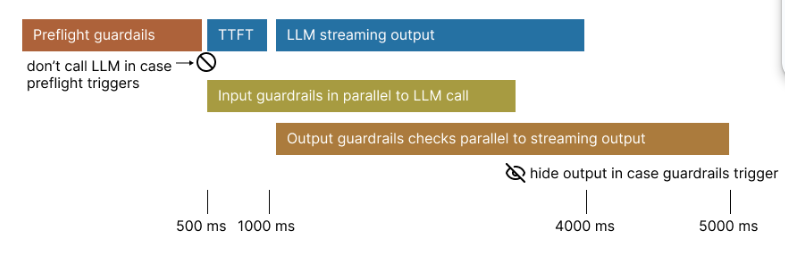

# Streaming vs Blocking

Guardrails supports two approaches for handling LLM output: non-streaming (safe, default) and streaming (fast). The choice balances safety vs. speed.

## Non-Streaming: Safe and Reliable (Default)



Default behavior (`stream=False`):

- **All guardrails complete** before showing output
- **Complete safety** - no unsafe content exposure
- **Higher latency** - user waits for full validation

**Best for**: High-assurance, compliance-critical scenarios

```typescript
const response = await client.responses.create({
  model: 'gpt-5',
  input: 'Your input',
  stream: false  // Safe and reliable (default)
});
```

## Streaming: Fast but Less Safe



Set `stream=True` for real-time output:

- **Pre-flight & Input guardrails** run first
- **LLM output streams** to user immediately
- **Output guardrails** run in parallel with streaming
- **Risk**: Violative content may briefly appear before guardrails trigger

**Best for**: Low-risk, latency-sensitive applications

```typescript
const response = await client.responses.create({
  model: 'gpt-5',
  input: 'Your input',
  stream: true  // Fast but some risk
});
```
